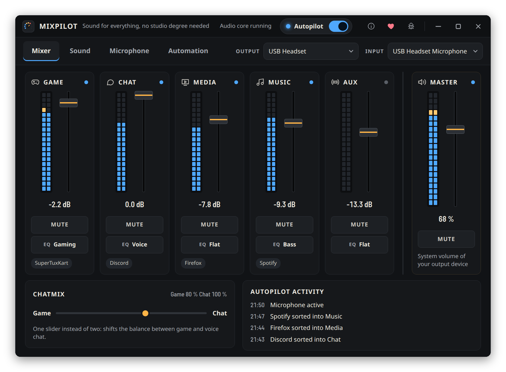
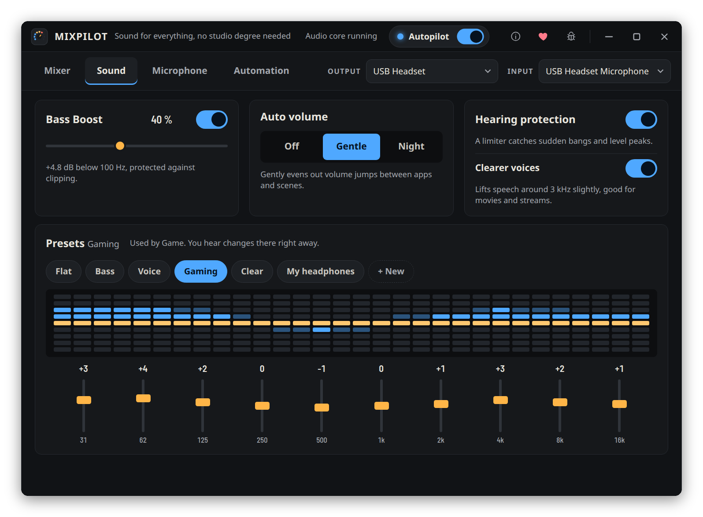
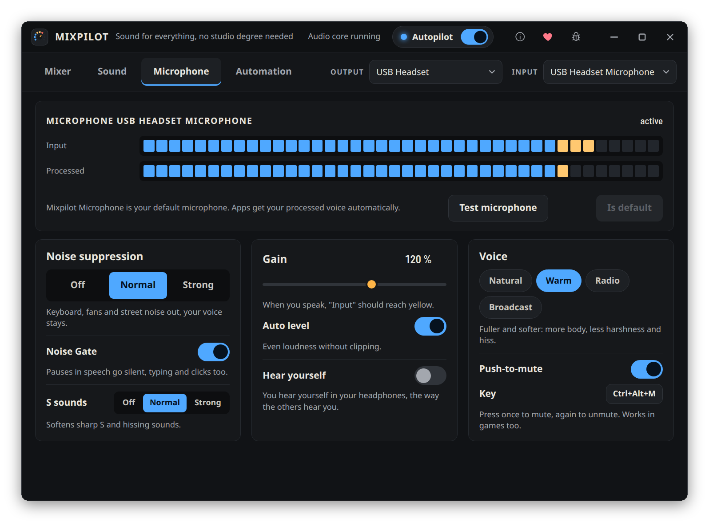
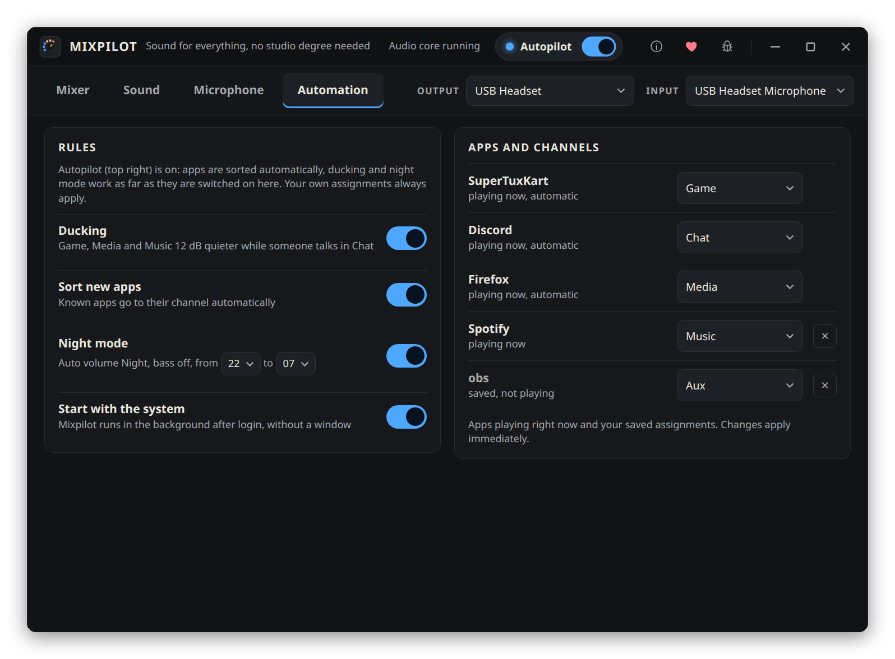

  

<h1 align="center">Mixpilot</h1>

  Mixer, sound and microphone control for PipeWire on Linux.

  

  
  
  

  

Mixpilot sorts your apps into four channels with their own faders, cleans up your
microphone and keeps the volume in check, without you having to learn audio routing.
Turn on the Autopilot and most of it happens by itself.

## Install

Mixpilot is available from the [Snap Store](https://snapcraft.io/mixpilot):

    sudo snap install mixpilot

On first start the app asks for two permissions. Connect them once:

    sudo snap connect mixpilot:pipewire && sudo snap connect mixpilot:audio-record

Needs PipeWire with WirePlumber, the default on most current distributions
(Ubuntu since 22.10, Fedora, Arch, openSUSE Tumbleweed).

## Features

<table>
  <tr>
    <td width="33%"></td>
    <td width="33%"></td>
    <td width="33%"></td>
  </tr>
  <tr>
    <td align="center">Sound</td>
    <td align="center">Microphone</td>
    <td align="center">Automation</td>
  </tr>
</table>

**Mixer**

- Five channels: Game, Chat, Media, Music and Aux, each with fader, meter, mute and its own EQ preset
- New apps land in the right channel automatically. Move one by hand and Mixpilot remembers it
- ChatMix: one slider for the balance between game and voice chat
- Master is your output device's own volume, the same one the volume keys change
- A chosen output device that disappears falls back to the system default and comes back when it returns

**Sound**

- 10-band equalizer per channel, shown as LED columns. The built-in presets (Flat, Bass, Voice, Gaming, Clear) can be tuned, up to four of your own come on top, the mixer picks one per channel
- Bass boost below 100 Hz with clipping protection
- Auto volume: Gentle evens out jumps between apps, Night lifts quiet parts and tames explosions
- Hearing protection limiter with 1 ms lookahead
- Clearer voices for movies and streams

**Microphone**

- Virtual "Mixpilot Microphone" for Discord, OBS and every other app
- Noise suppression (RNNoise), a noise gate with automatic threshold and a de-esser against sharp S sounds
- Auto level, gain up to 200 %
- Voice presets: Natural, Warm, Radio, Broadcast
- Hear yourself, with meters for the raw and the processed signal
- Microphone test: record five seconds and hear how the others hear you
- Push-to-mute: one key mutes and unmutes the microphone from anywhere, picked in your desktop's own shortcut dialog (GNOME 48 or newer, KDE Plasma)

**Automation**

- Autopilot switch in the title bar: on means sorting, ducking and night mode run by themselves
- Ducking: Game, Media and Music get 12 dB quieter while someone talks in Chat
- Night mode by time of day
- Starts with the system and stays in the tray (open, Autopilot, mute microphone, quit)

The interface is available in English and German.

## Planned

- Profiles (Gaming, Movie, Night) with one click, optionally switched by the running app
- Headphone correction based on measured frequency responses
- Compact mini mixer
- Separate output device per channel
- Separate stream mix for OBS

## Building from source

The repository has two parts that ship together:

- `core/` audio daemon in Rust (pipewire-rs). Reads `~/.config/mixpilot/config.json`,
  writes meters and app lists to `$XDG_RUNTIME_DIR/mixpilot/state.json`.
- `app/` Tauri 2 window and tray. Plain HTML/CSS/JS in `app/ui`, no npm.
- `snap/` snapcraft packaging.
- `worker/` Cloudflare worker that forwards bug reports, so the form key stays off the client.

Core:

    cd core && cargo build --release

App and .deb (the pkg-config shim is needed for the tray library):

    cd app && PKG_CONFIG_PATH=$PWD/pkgconfig cargo tauri build --bundles deb

Snap:

    snapcraft

### Tests

    cd core && cargo test

The live tests run against a private PipeWire without hardware, never against your own audio:

    sh sandbox.sh sh live-test.sh
    sh sandbox.sh sh feature-test.sh
    sh sandbox.sh sh stress-test.sh 120
    sh wp-restart-test.sh

## Bugs and support

Found a bug? Use the bug icon in the title bar, or open an issue here.

Mixpilot is free and stays free. If you want to support it, there is
[Ko-fi](https://ko-fi.com/simonlinuxcraft). Nothing gets unlocked by it.

## Credits

- Noise suppression: [nnnoiseless](https://github.com/jneem/nnnoiseless), a Rust port of RNNoise
- Built with [Tauri](https://tauri.app) and [pipewire-rs](https://gitlab.freedesktop.org/pipewire/pipewire-rs)
- Font: [Barlow Semi Condensed](https://github.com/jpt/barlow) by Jeremy Tribby, SIL Open Font License 1.1

All third-party licenses are listed in `app/ui/third-party-licenses.txt`.

## License

GPL-3.0, see [LICENSE](LICENSE).
